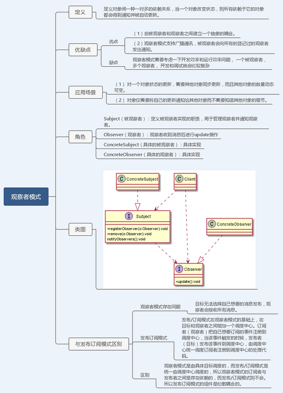

# 行为型模式

> 行为型模式包含模板方法模式、命令模式、访问者模式、迭代器模式、观察者模式、中介者模式、备忘录模式、解释器模式（Interpreter模式）、状态模式、策略模式、职责链模式（责任链模式）。行为型模式对在不同的对象之间划分责任和算法的抽象化，行为型模式不仅仅关注类和对象的结构，而且重点关注他们之间的相互作用，通过行为型模式，可以更加清晰地划分类与对象的职责，并研究系统在运行时实例对象之间的交互。
————————————————
版权声明：本文为CSDN博主「自由的♂」的原创文章，遵循CC 4.0 BY-SA版权协议，转载请附上原文出处链接及本声明。
原文链接：<https://blog.csdn.net/weixin_49592546/article/details/108082716>

